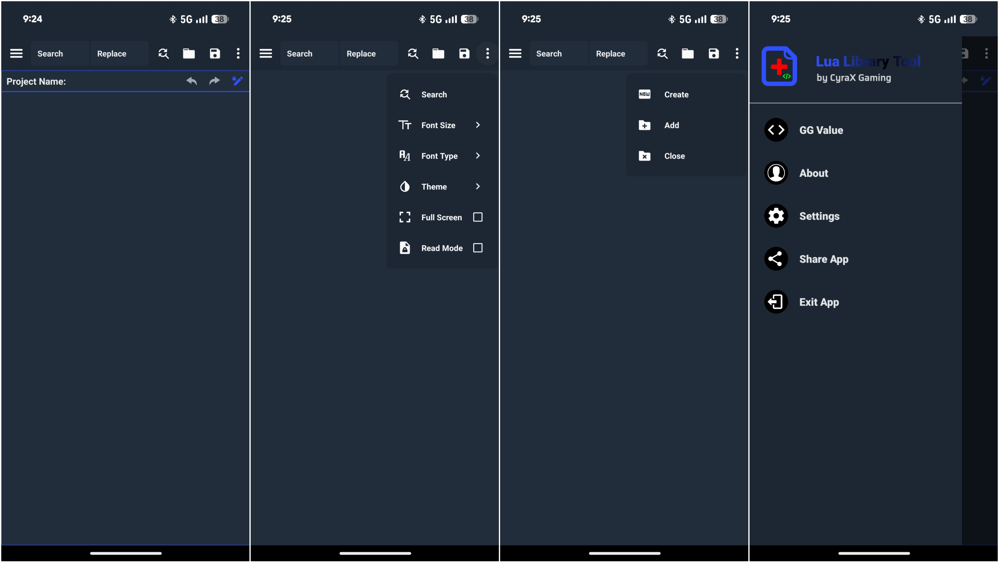

# Lua Library Tool

# Preview 

# What's New 
New Version 1.60 - Lua Library Tool This is the last updated version.

# Description 
The ability to create LUA scripts for games such as: PUBG Mobile, Free Fire, Call of Duty
The application has the values of GG for different functions (some of them may not work)
This is the original Lua Library Tool. It is developed by CYRAX GAMING. It was published in 5 October 2020 and its last update was in 6 December 2020.

# Official handle 👇🏻
GitHub: https://github.com/CYRAXApp
Telegram: https://t.me/CYRAXApps
